# 🗺️ MailManagement (Graduation Project)

---

## 📋 Proje Hakkında

Mail Management is a modern web-based email management platform that allows users to manage multiple Gmail and Outlook accounts from a single dashboard. The project aims to improve productivity by simplifying email workflows while ensuring high security through encryption, authentication mechanisms, and AI-powered features such as automatic replies and translation.

---

## 🛠️ Kullanılan Teknolojiler

### Backend

- Python
- Sanic Framework
- MySQL
- Gmail API
- Outlook API
- OpenAI API
- JWT
- OAuth2
- bcrypt
- AES

### Frontend

- React
- TypeScript
- Tailwind CSS
- Vite

---

## 🖼️ Screenshots

### 🏠 User Page

  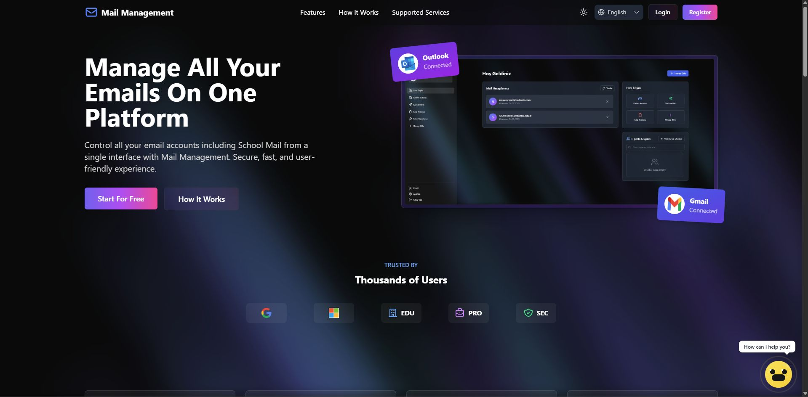
  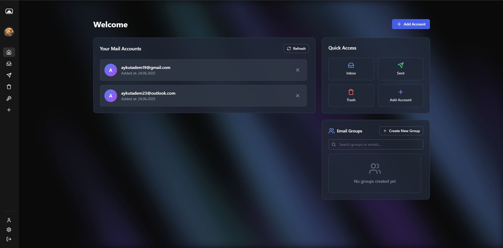
  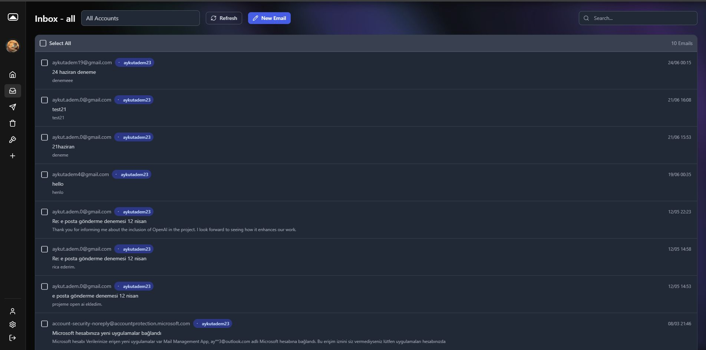
  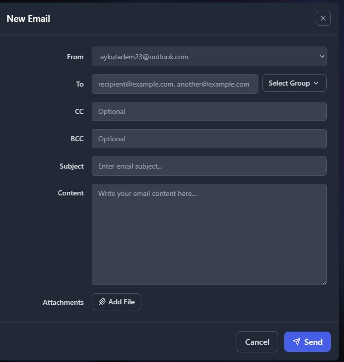
  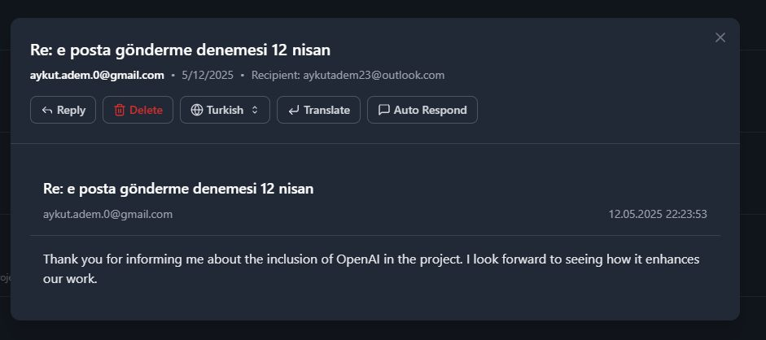
  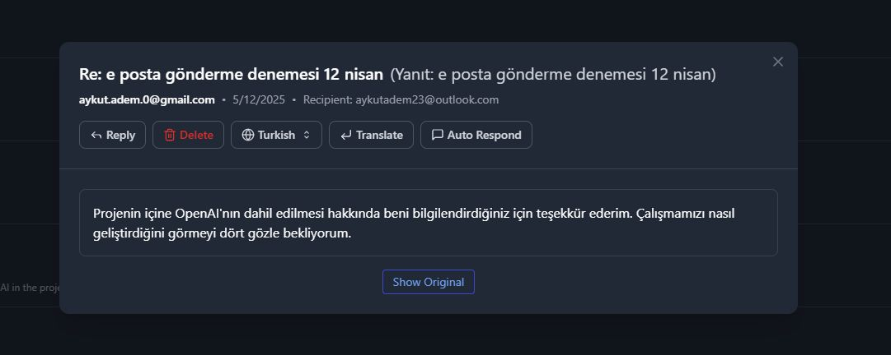
  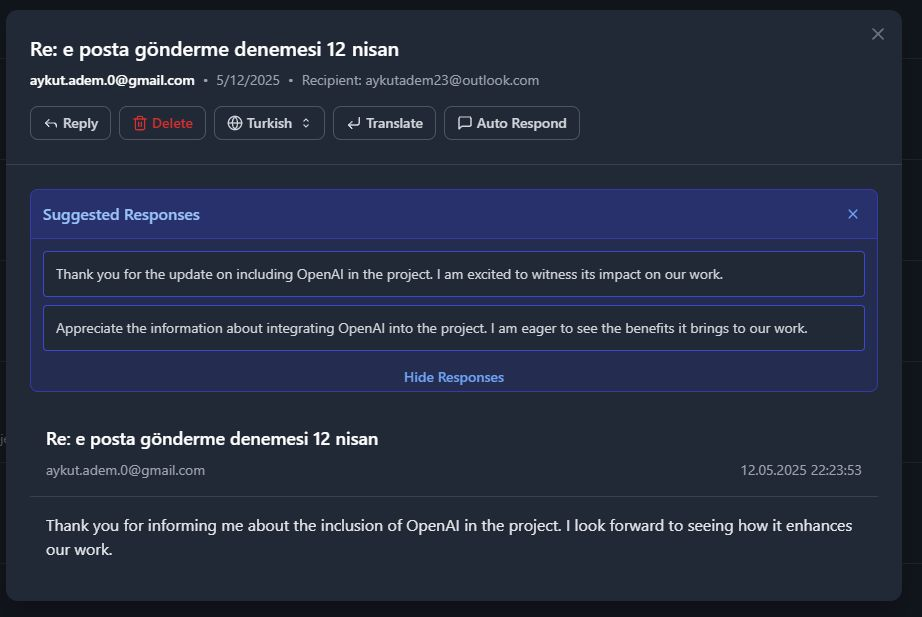
  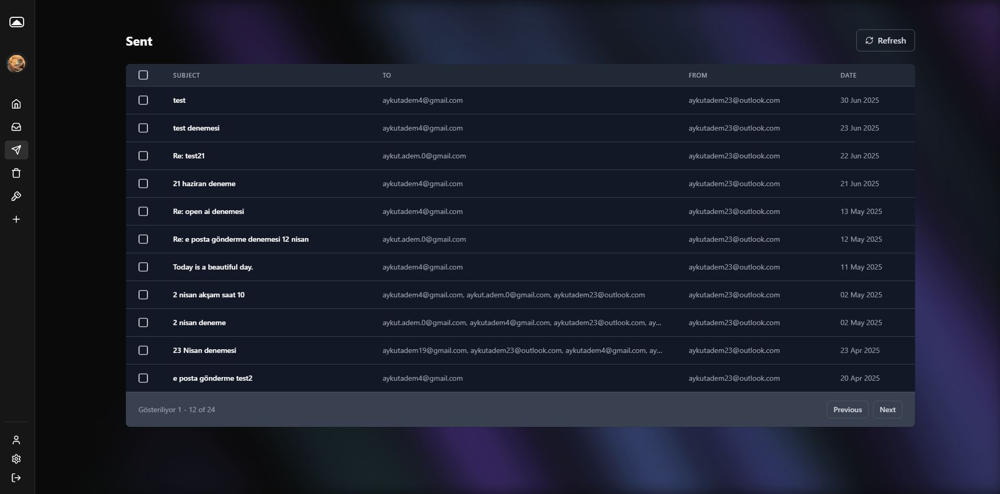
  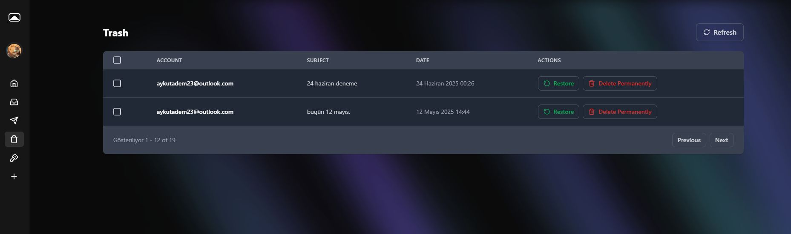
  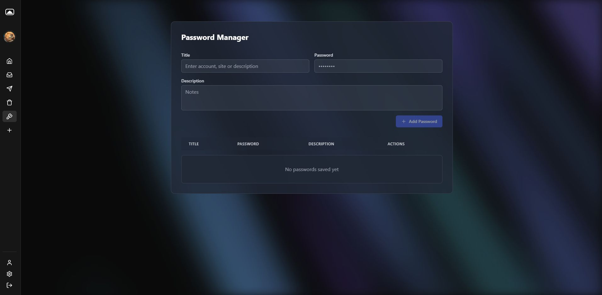
  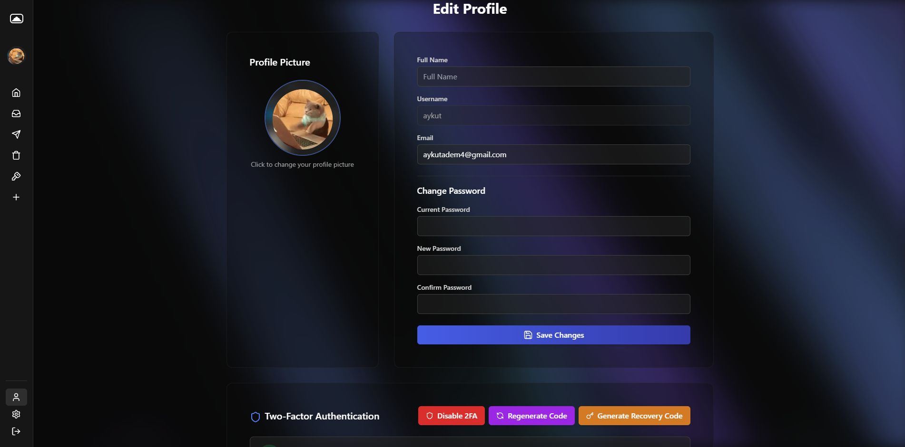

### 🔑 Login and Register Page

  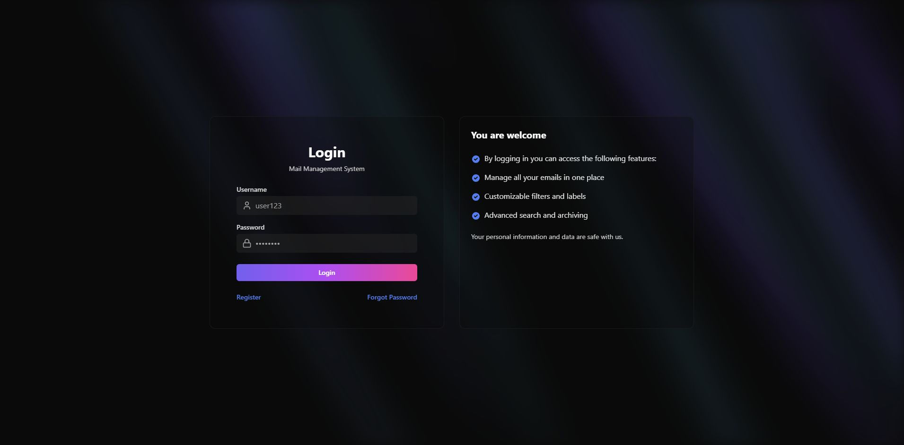
  

